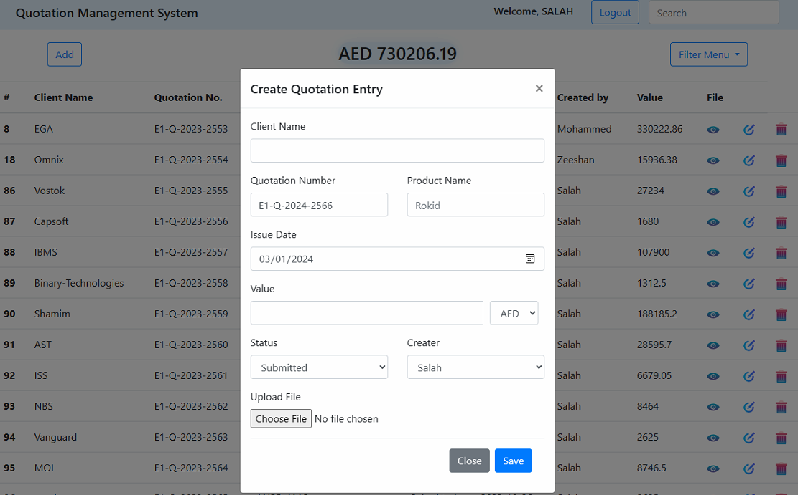

# Quotation Management System

Designed and implemented a Quotation Management System to streamline the creation, updating, deletion, and retrieval of quotations. This system serves as a comprehensive solution for managing quotes efficiently.

## Features

- **Creation of New Quotations:** Implemented a user-friendly interface for creating new quotations, capturing essential details such as client information, items/services, and pricing.
- **Update and Edit Functionality:** Provided a seamless update mechanism, allowing users to modify existing quotations with ease.
- **Delete functionality:** Implemented a delete functionality to remove the quotation with confirmation prompt.
- **User Authentication:** First user has to authenticate using their credentials to modify or see the existing quotations.

## Project Responsibilities

- **Full-stack Development:** Involved in the end-to-end development process, from conceptualization and planning to frontend and backend implementation.
- **User Interface Design:** Created a visually appealing and user-friendly interface using Bootstrap, HTML, and CSS for optimal user experience.
- **Backend Developemnt:** I used Strapi CMS here to act as backend of this system where I created RestApi for the integration to front-end.

## Outcome

The Quotation Management System has significantly improved the efficiency of managing quotations, providing a centralized and organized platform for creating, updating, and retrieving quotes. The system's user-friendly design and robust functionality contribute to a more streamlined quotation workflow.

